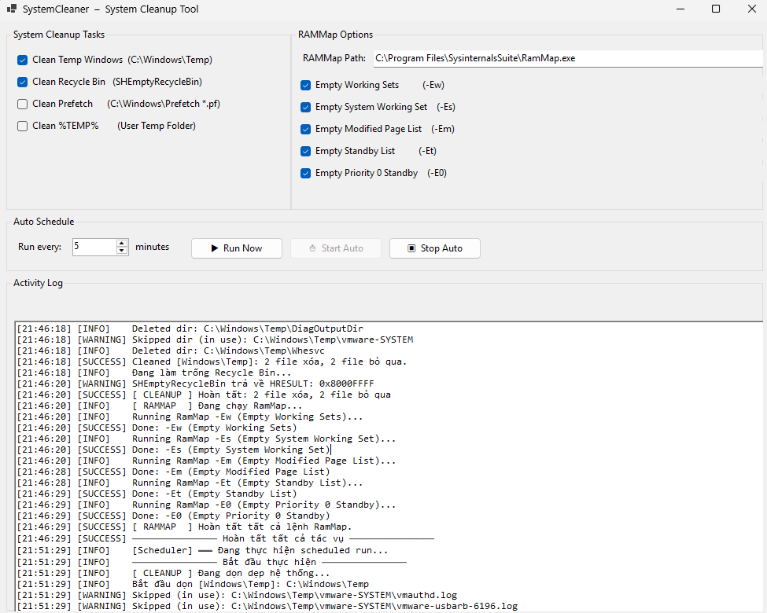
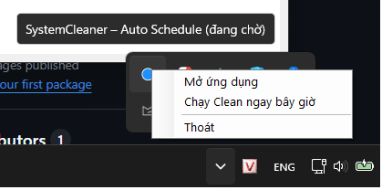

<div align="center">

# 🧹 System Cleaner

A lightweight Windows system cleanup tool built with **.NET 8 WinForms**.


</div>

---

## Overview

System Cleaner helps users keep Windows tidy and responsive by providing safe cleanup actions, RAM optimization via Microsoft Sysinternals RAMMap, automatic scheduling, and tray-based background execution.

## Highlights

- Clean Windows Temp and user temp folders
- Empty Recycle Bin
- Clean Prefetch files
- Run RAMMap commands for memory optimization
- Schedule automatic runs
- Minimize to tray with notifications
- Detailed activity log with timestamps
- Automatic RAMMap download when missing

## Screenshots

Replace the files in `Assets/` with your own screenshots.





## Architecture

```text
MainForm
├── CleanerService
├── RamMapService
├── SchedulerService
└── TrayIconService
         │
         └── Windows API / Sysinternals RAMMap
```

## Tech Stack

- .NET 8
- C# WinForms
- Windows API (P/Invoke)
- Async / Await
- Manual Dependency Injection
- Microsoft Sysinternals RAMMap

## Folder Structure

```text
SystemCleaner
├── Forms
├── Services
├── Assets
├── .github
└── README.md
```

## Getting Started

```bash
git clone https://github.com/tuanpv62/system-cleaner.git
cd system-cleaner
dotnet build
dotnet run
```

## Notes for Recruiters

This project demonstrates:
- desktop application design
- service-based structure
- Windows integration
- background scheduling
- safe file operations
- clean UX with tray icon and logs

## Roadmap

- Dark mode
- Export logs
- Update checker
- Multi-language UI
- Better settings management
- Portable release package

## License

MIT License
